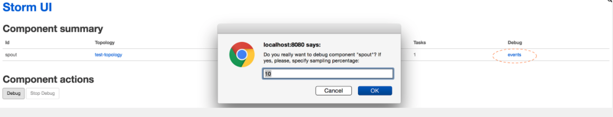

## Debugging an Apache Storm topology

[原文](https://community.hortonworks.com/articles/36151/debugging-an-apache-storm-topology.html)

#### 摘要:  

在本文中，我们将介绍在Apache Storm 1.0引入的调试和监控功能。

#### 正文

Apache Storm是一个高速处理大量数据的分布式实时计算系统。分布式系统的调试本质上来说很困难，因为许多非静止的部分散布在集群中的工作节点上。在系统中追踪特定component或者某个节点上的故障很困难，并且需要收集和分析在分布式集群中运行的大量日志和调试/跟踪进程。    

过去，Apache Storm集群对调试topology的支持非常少。用户必须首先打开调试日志，重新启动workers，重新部署topologies，然后从不同的工作节点收集日志并分析它们。如果他们想要使用命令行控制或者配置workers，将不得不登录到worker主机再运行痛苦的命令。如果想要检查流经topology中的tuples，必须添加专门的“调试”bolts来将tuples记录到某些日志，然后在将其在重新投入生产之前从topology中删除调试bolts。

在本文中，我们将介绍在Apache Storm 1.0中添加的新功能，使得调试storm topology的各个方面变得更容易。

### 1. Dynamic Log Levels
Storm允许用户和管理员从Storm UI和命令行动态更改正在运行的topolog的日志级别设置。无需重新启动任何Storm进程即可使设置生效。用户还可以指定可选的超时时间，时间之后这些更改将自动还原。生成的日志文件也可以从Storm UI和logviewer service轻松搜索到。

日志级别设置方式的应用与您期望的log4j相同。如果设置父logger的日志级别，子logger将开始使用该级别（除非子级别已经有更严格的级别）。

#### 1.1 通过Storm UI启用

要设置级别，请单击正在运行的topology，然后单击topology actions部分中的“Change Log Level”。    
    
图1：更改topology的日志级别。

接下来，提供logger名称，选择所需的级别（例如WARN）和以秒为单位的超时(如果不需要，则为0),然后点击“Add”。

在上面的示例（图1）中，在运行storm starter topology时，根logger设置为ERROR，storm.starter设置为DEBUG。 这样，我们可以更具体地查看来自“storm.starter”包的调试日志，而其他日志被抑制。

要清除日志级别，请单击“清除”按钮。这会将日志级别恢复为添加设置之前的日志级别。日志级别行将从UI中消失。

图2: 清除动态的日志级别

#### 1.2 使用CLI

日志级别可以通过命令行设置如下，

./bin/storm set_log_level [topology name] -l [logger name] = [LEVEL]:[TIMEOUT]

例如：    

	./bin/storm set_log_level my_topology -l ROOT = DEBUG:30。

将根ROOT记录器设置为DEBUG 时间为30秒。

	./bin/storm set _log_level my_topology -r ROOT

清除ROOT记录器动态日志级别，将其重置为其原始值。

有关详细信息，请参阅[JIRA STORM-412](https://issues.apache.org/jira/browse/STORM-412) 。

### 2.Topology Event logging

Topology Event logging 提供了当tuples流经storm topology中的不同阶段时查看tuples的能力。 这可以用于在topology运​​行时检查从topology管道中的spout 或bolt发射的tuples，而不停止或重新部署topology。 从spout到bolt的正常流动的tuples不受开启event logging的影响。

#### 2.1。 Enable event logging

注意：默认情况下禁用事件日志记录，并且需要首先通过将storm config“topology.eventlogger.executors”设置为非零值来启用。有关更多详细信息，请参阅配置部分。

可以通过单击topology视图中的topology操作下的“Debug”按钮来logging enents。 这将按照指定的抽样百分比从topology中的所有spout和bolt记录tuples。

 
图3: 在topology级别启用事件日志记录

您还可以通过转到相应的组件页面并在组件操作下单击“Debug”来在特定的spout或bolt级别启用事件记录。

图4：在组件级别启用事件日志记录。

#### 2.2 Viewing the event logs

storm “logviewer” 应该运行以查看记录的tuples。 如果尚未运行的log viewer可以通过从storm安装目录运行“bin/storm logviewer”命令启动。 要查看tuples，请从storm UI中转到特定的spout或bolt组件页面，然后单击component summary下的“events”链接（如上图4所示）。

这将打开一个视图，如下所示，您可以在不同的页面之间导航和查看记录的tuples。

 

图5：查看记录的事件。

事件日志中的每一行都包含一个对应于以逗号分隔格式从特定spout/bolt发出的tuples的信息：

`Timestamp, Component name, Component task-id, MessageId (in case of anchoring), List of emitted values`

### 2.3 Disabling the event logs

通过单击Storm UI中的topology或组件操作下的“Stop Debug”，可以在特定组件或topology级别禁用event logs。

 

图6：在topology级禁用event logs。

### 2.4 Configuration

event logging 将每个组件的事件（tuples）发送到内部事件记录器bolt。 默认情况下，由于在打开事件日志记录时性能略有下降，Storm不会启动任何事件记录器任务。 这可以通过在提交topology（在storm.yaml中全局或使用命令行选项）时设置以下参数来更改。

|参数	       |含义        	|   何时使用 |
|		------:|	------:|  	-------:|
|topology.eventlogger.executors：0	|不会创建event logger任务（默认）|如果你不打算检查tuples以及不想要轻微的性能打击
|topology.eventlogger.executors：1	|topology的一个event logger任务|如果要从特定spout或bolt采样低百分比的tuples。这可能是最常见的用例
|topology.eventlogger.executors：nil	|每个worker程序一个event logger任务|如果要以非常高的采样百分比对整个topology（所有spout和bolt）进行采样，并且tuples速率非常高。|

### 2.5 Extending event logging

Storm提供了由event logger bolt用来记录事件的IEventLogger接口。默认实现是FileBasedEventLogger，它将event记录到events.log文件（`logs /workers-artifacts/<topology-id> /<worker-port> /events.log`）。 可以添加IEventLogger接口的其他实现来扩展事件日志记录功能（比如构建搜索索引或将事件记录到数据库中）

	  / **
	  * EventLogger接口，用于将事件信息记录到像日志文件或db的接收器
	  *用于通过UI检查事件以进行调试。
	  * /
	 public interface IEventLogger {
	     void prepare（Map stormConf，TopologyContext context）;
	     / **
	      *当{@link EventLoggerBolt}从spouts或bolt接收到一个元组时调用
	      *启用事件记录。
	      *：
	      * @param e事件
	      * /
	     void log（EventInfo e）;
	     / **
	      *当清除事件记录器螺栓时调用
	      * /
	     void close（）;
	 }}
	 
有关更多详细信息，请参阅[JIRA STORM-954](https://issues.apache.org/jira/browse/STORM-954) 。

### 3 Distributed Log Search

Storm的UI的另一个改进是添加了分布式日志搜索。 此功能允许用户搜索特定topology的所有日志文件，包括归档日志。搜索结果将包括所有supervisor节点的匹配项。

图7：分布式日志搜索输出

此功能非常有助于在topology的工作线程或supervisorm模式上搜索。UI中特定的工作日志文件中也支持类似的日志搜索。

有关详细信息，请参阅[JIRA STORM-902](https://issues.apache.org/jira/browse/STORM-902) 。

### 4.Dynamic Worker Profiling

用户现在可以直接从Storm UI请求工作程序配置文件数据，包括heap dumps，JStack输出和JProfile记录，而无需重新启动其topology。

生成的文件可用于通过各种调试工具的日志查看器下载以进行离线分析。 现在也可以通过Storm UI重新启动工作。

 

图8：分析和调试工作程序

通过切换到相应的文件，可以从工作日志查看器UI查看输出。

 

图9：从Storm UI查看的Jstack输出

有关更多详细信息，请参阅JIRA STORM-1157 。

5.结论
我们介绍了Apache Storm 1.0中添加的一些新功能，这些功能应该使调试Storm拓扑的各个方面更加容易，直观，更加用户友好。 这些功能允许Apache Storm用户在遇到任何问题时快速解决他们的topology。