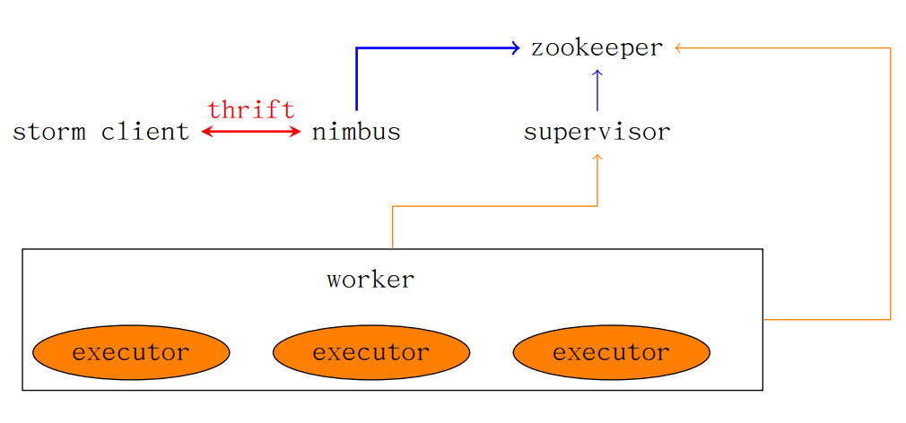

## 整体分析

图1. 整体图 

#### nimbus

1. nimbus作为thrift-server，会接收提交的作业，并将作业的topology代码保存到协调节点Zookeeper命名空间的/nimbus/stormdist/目录中， 而后进行任务的分配，所谓任务的分配，是指根据系统中各个工作节点的运行时负载，确定作业组件在工作节点的工作进程和工作线程的分配，并将分配信息写入Zookeeper命名空间。
2. 监听supervisor对相关作业的下载请求并提供下载。
3. 通过协调节点Zookeeper命名空间读取数据，监控整个集群的状态。监控的实现是，worker向zookeeper发送心跳，读取是否发送心跳。

#### zookeeper在storm中的分布协调工作

1. 存储提交作业的信息，由supervisor负责将作业任务(task, 即spout/bolt的实例)的分配信息写入Zookeeper，由supervisor从zookeeper上读取任务分配信息。
2. 存储supervisor和工作进程(worker)的心跳，运行时状态，使得nimbus可以监控整个集群的状态，从而识别工作进程的故障，并通过维护的状态重启这些故障的工作进程。
3. 存储整个Storm系统的所有状态信息和配置信息。   

#### supervisor

1. 定时从协调节点检查是否有新提交的作业，并下载相关代码包到本地。根据任务配置信息等组织相关进程或线程。
2. 定时从协调节点检查是否有本地运行的作业被撤销，并进行相应处理。
3. supervisor支撑作业的计算，但supervisor的进程退出并不会影响已提交的作业的运行。
